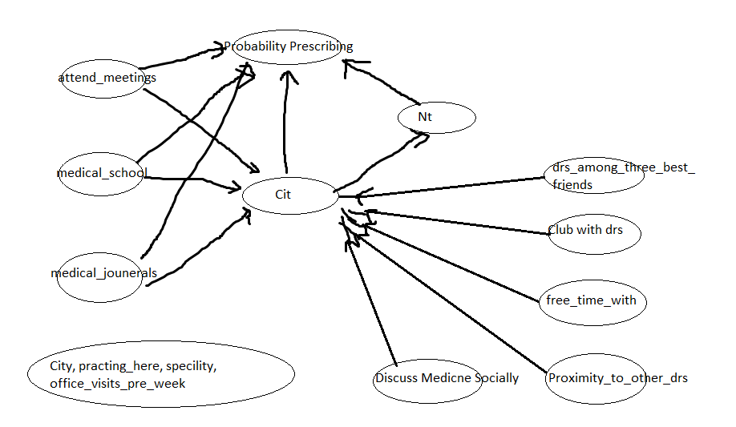

```{r Import data from file,echo=FALSE,results='hide',message=FALSE,warning=FALSE}
## Set Directory
setwd("C:/Users/Zuojun/Desktop/36-402/Exam3")
nodes= read.csv("ckm-nodes.csv")
net = read.table("ckm-net.dat")

library(rmarkdown)
library(mixtools)
library(plyr)
library(np)
library(mgcv)
```


### Introduction 

Ideas are a powerful source that can push humanity forward. Great ideas starts trivial, but will eventually spread like virus. In modern society, we want to capture how exactly ideas spread. In particular, we want to examine how the new antibiotic tetracycline spreads among doctors in four local communities in the state of Illinois back in 1950s. We want to focus on how the doctors start to adopt the new idea of using tetracycline, and the relationship between their innovation and their medical school education, medical journal read, medical conferences attended, and how the other doctors within the network react to the new antibiotics. Some argue that ideas and innovation spread from person to person through direct contact, and we want to test this hypothesis through statistical models and casual inference. 


### Modeling

#### Discovering underlying patterns

We have information from 264 doctors from four different communities across 17 months starting from November 1953. We know about their date of adopting the new antibiotics, years when they attended medical school, whether they attend medical conference lately, the number of medical journals they read within the time period. We also know who they usually spend their free time with, if the discuss medicine socially, and other variables. We also have a record of connections between each doctors within the study in a binary matrix. We want to use these information to help us to infer how the innovation ideas spreads.

In order to observe how the new idea spread amongst the doctors in these four communities, we want to focus on the doctors that we have information about their adoption date of the drug. Then we look at the graph of the number of doctors adopting the new drug over time, and the total number of doctors adopting the drug over time. 


```{r time vs prescribtion types, echo=FALSE}

# plot number of doctors who began prescribing the teracycline each month versus time

par(mfrow=c(2,1))
plot(c(1:17),table(nodes$adoption_date)[1:17],pch=16,cex=0.7,main="Doctors began prescribtion with time",xlab="Month",ylab="Number of Doctors",xaxt="n",type="b")
axis(1,at=1:17,labels=as.character(c("Oct","Nov","Dec","1954","Feb","Mar","Apr","May","Jun","Jul","Aug","Sept","Oct","Nov","Dec","1955","Feb")))


#Produce another plot of the for total number of doctors precrbing each month
plot(c(1:17),cumsum(table(nodes$adoption_date)[1:17]),pch=16,cex=0.7,main="Total Number of Doctors began prescribtion with time",xlab="Month",ylab="Number of Doctors",xaxt="n",type="b")
axis(1,at=1:17,labels=as.character(c("Oct","Nov","Dec","1954","Feb","Mar","Apr","May","Jun","Jul","Aug","Sept","Oct","Nov","Dec","1955","Feb")))

par(mfrow=c(1,1))

```

We can observe from the graphs above that starting from the very first month all the way to half a year later, the number of doctors prescribing the drug is increasing. However after July 1954 the number of doctors who begun to adopt the drug dropped to a relatively steady and low level (this is also reflected on the total number of doctors prescribing). We can see that the doctor's in the local community is experiencing a "saturated" effect: number of doctors prescribing decreases after certain period of time as the total number of doctors prescribing increases. Therefore we want to explore the potential relationship between the probability of a doctor adopting the new drug and the total number of doctors already prescribing the drug. 

```{r problem2-1 data construction,echo=FALSE}

# We remove all the rows with an NA value in the adoption date column
nodes.adoptfull = nodes[which(nodes$adoption_date !="NA"),]

# Number of people prescribing by month
adopt.by.month = as.vector(table(nodes.adoptfull$adoption_date))[1:17]

# Number of people prescribed by far by month
adopt.byfar.by.month = as.vector(cumsum(table(nodes$adoption_date)[1:17])-table(nodes.adoptfull$adoption_date)[1:17])

# Number of people adopting / Number of doctors that have yet to prescribe = probability
adopt.prob.by.byfar = adopt.by.month / (nrow(nodes.adoptfull)-adopt.byfar.by.month)

adopt.prob = data.frame(adopt.prob.by.byfar,adopt.byfar.by.month)
```


```{r Kernel model, echo=FALSE,message=FALSE,warning=FALSE,results='hide',cache=TRUE}

# Or do we implement kernel regerssion?

np.prob.adopt = npreg(adopt.prob.by.byfar~adopt.byfar.by.month,tol=1e-3, ftol=1e-4)

# Cross-validated MSE
np.prob.adopt$bws$fval

# we want to calculate the MSE for GLM and see how it preforms
# Cross-Validation for GLM
cv.glm = function(data=adopt.prob,nfolds=5) { 
  n = nrow(data)
  result = rep(0,nfolds)
  fold.labels <- sample(rep(1:nfolds, length.out=n))
  for (fold in 1:nfolds) {
    test.rows <- which(fold.labels == fold)
    train = data[-test.rows,]
    test = data[test.rows,]
    current.model = glm(adopt.prob.by.byfar~adopt.byfar.by.month,data=train,family="binomial")
    estimated = predict(current.model,newdata=test,type="response")
    test.errors = test$adopt.prob.by.byfar-estimated
    result[fold] = mean(test.errors^2)
  }
  #colnames(log.like) = paste("Factor",factor.vec)
  return(mean(result))
}

problem.2.glm.mse = cv.glm()

```


```{r calibration check,echo=FALSE}

par(mfrow=c(1,2))
# Observed vs predicted
plot(adopt.byfar.by.month,adopt.prob.by.byfar,pch=16,cex=0.7,main="Observed vs Predicted")
points(adopt.byfar.by.month,predict(np.prob.adopt),col=2,pch=16,cex=0.7,type="b")

# Observed vs predicted on calibration
plot(predict(np.prob.adopt),adopt.prob.by.byfar,pch=16,cex=0.7,main="Kernel Calibration Plot",xlim=c(0,0.3),ylim=c(0,0.3))
abline(0,1,col=2)

```

Under our assumptions, at each given month t, the probability of a doctor adopting the drug is computed by the number of doctors adopting the drug at month t over the total number of doctors that have not adopted the new drug this month. We want to model these probabilities against the total number of doctors already prescribing the new antibiotics at this month. We proposed two models, kernel regression and generalized linear models with logistics regression. We compare both models by their MSEs. Kernel model's cross-validated MSE is `r signif(np.prob.adopt$bws$fval,3)` and that for GLM is `r signif(problem.2.glm.mse,3)`. 
Besides the better goodness of fit, we conclude that Kernel regression is more appropriate in this situation because we do not need to assume any distribution or ordering of our observed value, which appears to be in a curve. We then plot the model's estimated probabilities against the observed values, and it appears to be a good fit. With the low MSE and appropriate goodness of fit, we decided to proceed with kernel regression. 


```{r Kernel model and bs, echo=FALSE,message=FALSE,warning=FALSE,results='hide',cache=TRUE}
# How would this look if we want to span this across all 125 possiblities?
# Bootstrap confidence band for kernel model
# This function resample our adopt probability data by case
resample <- function(x) {sample(x,size=length(x),replace=TRUE)}
resample.rows.adopt.prob<- function() {
  sample.rows <- resample(1:nrow(adopt.prob))
  return(adopt.prob[sample.rows,])
}

# This function inputs a dataset and returns a fitted kernel model with chosen bandwith
np.pred.prob <- function(data=adobt.prob,tol=0.1,ftol=0.1) {
  bw <- npregbw(adopt.prob.by.byfar~adopt.byfar.by.month, data=data, tol=tol, ftol=ftol)
  fit <- npreg(bw)
  return(fit)
}

# This allows us to create a evaulation vector to measure how our model will act across all number of doctors prescribed before the given month, and the eval.npr function will take a kernel model and provide it's estimate from 0 to 125 (all possibe number of doctors that begun to prescribe at the given month). The result are the probability of a doctor begin prescribing given the number of doctors already prescribing in previous month
evaluation.points <- seq(from=min(adopt.byfar.by.month),to=125,length.out=126)
evaluation.points <- data.frame(adopt.byfar.by.month=evaluation.points)
eval.npr <- function(npr) {
  return(predict(npr,newdata=evaluation.points,type="response"))
}
# this is our model's prediciton over 0-125 
main.curve <- eval.npr(np.prob.adopt)

#This will replicate the predicted values on a resampled data and compute it's confidence band for our given main model
npr.adopt.prob.cis <- function(B,alpha) {
  tboot <- replicate(B,eval.npr(np.pred.prob(resample.rows.adopt.prob())))
  low.quantiles <- apply(tboot,1,quantile, probs=alpha/2)
  high.quantiles <- apply(tboot,1,quantile,probs=1-alpha/2)
  low.cis <- 2*main.curve - high.quantiles
  high.cis <- 2*main.curve - low.quantiles
  cis <- rbind(low.cis,high.cis)
  return(cis)
}

np.adoptprob.cis = npr.adopt.prob.cis(1000,0.1)
```


```{r ploting kernel estimation,echo=FALSE}

par(mfrow=c(1,1))
plot(0:125,main.curve,pch=16,cex=0.7,type="l",main="Kernel Estimation with Confidence Band",ylim=c(0,0.3),col=2,xlab="Total Number of Doctors Adopted",ylab="Probability of a doctor adopting")
points(adopt.byfar.by.month,adopt.prob.by.byfar,pch=16,cex=0.7,col=1)
points(0:125,np.adoptprob.cis[1,],type="l",col=3)
points(0:125,np.adoptprob.cis[2,],type="l",col=3)
legend("topright",legend=as.character(c("Kernel Estimate","90% Confidence Band","Origional Points")),
       pch=c(NA,NA,16),lty=c(1,1,NA),col=c(2,3,1),cex=0.7)

```

Given our model, we want to see how the probability of a doctor prescribing changes with the total number of doctors prescribing. We want to discover if there is any underlying relationship between the two variables. We plot the estimated probabilities across all possible number of doctors adopting the drug in our model, and we observed that the probabilities was highest when the total number of doctors adopted being around 60, and are lower on both ends of the spectrum. This is not sufficient for us to make a conclusion with regard to the relationship between the probability of a doctor adopting the drug and the total number of doctors already prescribing. Also, since the probability and the total number of doctors adopting changes every month and each value of total number of doctors adopting is applied to a certain set of doctors, we want to take the average predictive comparison across all doctors and months to determine the effect of number of change in doctors adopting and the probability of a new doctor adopting. 

```{r APC and bootstrap se for kernel, echo=FALSE,cache=TRUE,results='hide'}

# The apc functions below are quoted from the previous homework solution with slight modification

# This function takes in a data point i, a selected coveriate, a model, and a dataframe
# The what_if function takes in a data point i in dataframe, and fix the selected variable var, and applyting all covariates other than var with the same value at data point i. Var stays the same as the observed value. Then we give our prediction from our input model given our new data frame. The function outputs this prediction
what_ifs <- function(i, var, model, df) {
  newdf.i <- df
    # Convert a column name to an index number...
  if(is.character(var)) { var <- which(colnames(df)==var) }
    # ... so we can exclude that column when copying over the values of data
    # point i
  newdf.i[,-var] <- df[i,-var]
    # newdf.i now has all observed values for var, but all other variables match
    # the focal data point i
    # Calculate and return our predictions
  return(predict(model,newdata=newdf.i))
}

# This function takes in a data point i, a selected coveriate, a model, and a dataframe, and a value of log.var
# This compares the base prediction of our given model and the given dataframe, at data point i, then compute a new prediction
# new_preds with the what_if function (returns a vector of predicted values with fixed covariates other than var). Then we would calculate the differences (or log difference if log.var = True) between our origional model prediction and our prediction from what_if, and all of the difference in distnace. Then we store the sum of differnece in numerator.term and the sum of all the variable distance in denominator.term. We also mutiply each term by the sign of the distance in order to keep our changes in distance relative (absoulte value for denominator and preserve the direction of vector distance in numerator). 
apc.ratio.terms <- function(i, var, model, df, log.var=FALSE) {
  baseline_pred <- predict(model,newdata=df)[i] # origional prediction at datapoint i
  new_preds <- what_ifs(i, var, model, df) # new predcition given fixed covariates and observed chosen variable
  baseline_var <- df[i,var] # The given datapoint and the observed value
  new_vars <- df[,var] # All observed values
  if (log.var) {
    var_changes <- log(new_vars) - log(baseline_var) # calcluating log distance between values if log.var = True
  } else {
    var_changes <- new_vars-baseline_var # calculating distance between all chosen variable with the datapoint i's var value
  }
  var_signs <- sign(var_changes)# Compute the sign in order to keep the disntace relative (like absolute value)
  numerator.term <- sum((new_preds-baseline_pred)*sign(var_changes)) # sum of all predicted relative difference to point i
  denominator.term <- sum(var_changes*sign(var_changes)) # sum of all relative distance to point i
  return(c(numerator.term,denominator.term))
}

# Then we loop this over all data entries in our model and compute the average predicive comparsion across all our rows
# In order to estimate how the variable influence the predicted values with all other covariates fixed
apc <- function(var, model, df,log.var=FALSE) {
  num.denom <- c(0,0) 
  for (i in 1:nrow(df)) {
    num.denom <- num.denom + apc.ratio.terms(i,var,model,df,log.var) # calculate all differnece over all data points
  }
  return(num.denom[1]/num.denom[2]) # Average predictive comparsion
}

##############################################################

# We first start a dataset for our estimation, our given range of number of doctors adopted and probability of doctor adopting
# then we calculate the average predictive comparsion for our model
kernel.apc.df = data.frame(pred=main.curve,adopt.byfar.by.month=c(0:125))
apc("adopt.byfar.by.month",model=np.prob.adopt,kernel.apc.df) # workes

####### Bootstrapping for APC ###########
# In order to have more measure of uncertainity, we use resampled data to measure our our mean and standerd error for our APC. 
# the methods and equations are obtained from Gelman and Pardoe (2007) and their writing of "Average Predictive comparsion for models with nonlinearity,interaction,and variance components"

# resample data
resample.rows.apc<- function(df) {
  sample.rows <- resample(1:nrow(df))
  return(df[sample.rows,])
}


# Bootstrap
apc.bs.se <- function(B,var, model, df,log.var=FALSE) {
  tboot = replicate(B,apc(var, model, df=resample.rows.apc(df),log.var=FALSE))
  mu = mean(tboot)
  se = ((sum(tboot[]-mu)^2)/(B-1))^0.5
  return(c(mu,se))
}

kernel.apc.mean.se = apc.bs.se(100,"adopt.byfar.by.month",model=np.prob.adopt,kernel.apc.df)

```

We used bootstrap resampled data to compute the average predictive comparison averaging over doctors and months for our given model. This method with uncertainty provides a more accurate estimation of the true value and thus make our prediction and conclusion more accurate. Given that the average predictive comparison for our kernel model is `r signif(kernel.apc.mean.se[1],3)` and a standard error of `r signif(kernel.apc.mean.se[2],3)` , we conclude that with one unit of change in total number of doctors prescribing, the probability of a doctor adopting the drug at the given month is expected to change by `r signif(kernel.apc.mean.se[1],3)`. We conclude that the relationship between the probability and the total number of doctors is rather insignificant.

We then proceed to check the potential relationship between the number of doctors in the doctor's network adopting the drug and the probability of this doctor adopting the drug at a given month. Given the information we know about each doctor and their network, we constructed a data frame that contains all combinations of doctors and months, and their status in terms of whether they are adopting the drug this month, and whether this doctor has already been prescribing the drug, and the total number of other doctors in his network prescribing the drug in this given month. Given the assumption that all probabilities across all months of doctors prescribing are the same, we want to find out the relationship between the probability of a doctor begin to adopt the drug at a given month and the total number of doctors in his network already prescribing. 


```{r network fullset,echo=FALSE,results='hide'}

# We remove the connections that are not revelant to our analysis, we take away the docotrs in this relationship map that does not have information with regard to prescribing the new drug
net.adopt.full = net
net.adopt.full = net.adopt.full[which(nodes$adoption_date !="NA"),]
net.adopt.full = net.adopt.full[,which(nodes$adoption_date !="NA")]

# We want to find out a doctor i who had not yet adopted the drug will begin to do so in month t, as a function of number of doctors that doctor i is linked to has adopted the drug. We want to find out, for those doctors that adopted at given month t,

# Create dotors by month
doc.by.month=expand.grid(doctor=which(nodes$adoption_date !="NA"),month=c(1:17))

# We want to find out whether the doctor begin prescribing tetracycline that month, 1 for begin, 0 for already or not adopting
docbymonth.beign = function(df.nodes=nodes.adoptfull,df.docbymonth=doc.by.month){
  # For each month in df.docbymonth, edit the value as 1 if df.docbymonth$month == df.nodes$adoption_date, and 
  result = rep(0,length.out = nrow(df.docbymonth)) 
  result[which(df.docbymonth$month == df.nodes$adoption_date)] = 1
  return(result)
}

# Doctors at a given month already prescribing the drug, 1 being adopted, 0 being not adopted or adopting
docbymonth.adopted = function(df.nodes=nodes.adoptfull,df.docbymonth=doc.by.month){
  result = rep(0,length.out = nrow(df.docbymonth))
  # print(length(result)) # remove when finished
  result[which(df.docbymonth$month > df.nodes$adoption_date)] = 1
  return(result)
}

# test to see if this matches our previous adopt.byfar.by.month
tapply(docbymonth.adopted(), (seq_along(docbymonth.adopted())-1) %/% 125, sum) == adopt.byfar.by.month
# They match!

# This is a helper function that helps us to compute the matrix mutiplication of the connection matrix with a given vector
# our goal is to use compute the product of connection matrix and the adopted matrix at a given month, and the result would
# yield in a vector form, given doctor's number of connections that are prescribing the new drug
mutiple.matrix = function(vector){
  result = as.matrix(net.adopt.full)%*%as.vector(vector)
  return(result)
}

# Doctors', at a given month, total connections that have adopted the drug at the previous month 
# this function computes the matrix mutiplication with the previous helper function for the given doctor's number of conections
# that are prescribing the new drug over segments of the adopted vector by 125, then we return the result as a single vector
# of 2125 in length, with each number denoting the Doctors', at a given month, total connections that have adopted the drug at the 
# previous month 
docbymonth.cit = function(){
  result = tapply(docbymonth.adopted(), (seq_along(docbymonth.adopted())-1) %/% 125,mutiple.matrix)
  result = as.vector(unlist(result))
  return(result)
}


# Test to see our final results are accurate
for (index in (0:16)){
  lower = (index*125+1)
  upper = (index+1)*125
  a = as.matrix(net.adopt.full)%*%as.vector(docbymonth.adopted()[lower:upper])
  b = docbymonth.cit()[lower:upper]
  print(sum(a==b))
}
# They indeed match!

# Now we add these vectors into our doctor by month dataframe
doc.by.month["begin"] = docbymonth.beign()
doc.by.month["adopted"] = docbymonth.adopted()
doc.by.month["cit"] = docbymonth.cit()

  
```


```{r estimated probability for begin with cit, echo=FALSE,results='hide'}

# we want to findout a subset of our dataset, doc.by.month, in which we do not contain doctors that are currently prescribing
doc.by.month.begin.only = doc.by.month[which(doc.by.month$adopted!=1),]

# then we attempt to fit a model that is approiate for our case
glm.citprob = glm(begin~cit,data=doc.by.month.begin.only,family="binomial")

## Predicting over 0 to 30
evaluation.points.cit <- seq(from=0,to=28)
evaluation.points.cit <- data.frame(cit=evaluation.points.cit)
eval.npr.cit <- function(npr) {
  return(predict(npr,newdata=evaluation.points.cit,type="response"))
}
# this is our model's prediciton over 0-30 
main.curve.cit.glm = eval.npr.cit(glm.citprob)


```


```{r Bootstrap for confidence band for glm,echo=FALSE,results='hide',warning=FALSE,message=FALSE,cache=TRUE}

# How would this look if we want to span this across all 125 possiblities?
# Bootstrap confidence band for our GLM logistic model
# This function resample a given data frame
resample <- function(x) {sample(x,size=length(x),replace=TRUE)}
resample.rows = function(df) {
  sample.rows <- resample(1:nrow(df))
  return(df[sample.rows,])
}

# This function inputs a dataset and returns a fitted GLM model log
estimate.glm <- function(df) {
  fitted.model = glm(begin~cit,data=df,family="binomial")
  return(fitted.model)
}

# This allows us to create a evaulation vector to measure how our model will act across all number of doctors prescribed before the given month, and the eval.npr function will take a kernel model and provide it's estimate from 0 to 125 (all possibe number of doctors that begun to prescribe at the given month). The result are the probability of a doctor begin prescribing given the number of doctors already prescribing in previous month
evaluation.points.cit <- seq(from=0,to=28)
evaluation.points.cit <- data.frame(cit=evaluation.points.cit)
eval.glm.cit <- function(mdl) {
  return(predict(mdl,newdata=evaluation.points.cit,type="response"))
}
# this is our model's prediciton over 0-30 
main.curve.cit.glm = eval.glm.cit(glm.citprob)


#This will replicate the predicted values on a resampled data and compute it's confidence band for our given main model
glm.bs.cis <- function(B,alpha,df) {
  tboot <- replicate(B,eval.glm.cit(estimate.glm(resample.rows(df))))
  low.quantiles <- apply(tboot,1,quantile, probs=alpha/2)
  high.quantiles <- apply(tboot,1,quantile,probs=1-alpha/2)
  low.cis <- 2*main.curve.cit.glm - high.quantiles
  high.cis <- 2*main.curve.cit.glm - low.quantiles
  cis <- rbind(low.cis,high.cis)
  return(cis)
}

glm.citprob.cis = glm.bs.cis(1000,0.1,doc.by.month.begin.only)

```

We decided to use generalized linear models with logistic regression to make our predictions. Even if it does not provide as accurate of a prediction as our kernel regression, it can make predictions beyond our given range of number of doctors in network prescribing (x-values). Kernel preforms poorly as its prediction turns flat when there are no observations at the extended range. Since we have a very limited number of x-values (from 0 to 9) and we want to make a prediction at a longer range of x-values, we decided to move on with generalized linear model. 


```{r graphical representation of glm estimate with confidence band,echo=FALSE}

# Graphical visualization of our glm model
plot(0:28,main.curve.cit.glm,main= "Glm estimate with confidence band",pch=16,cex=0.7,type="l",ylim=c(0,1),xlab="Number of connected doctors adopted",ylab="Probability of this doctor adopting",col=3)
points(doc.by.month.begin.only$cit,doc.by.month.begin.only$begin,cex=0.7,pch=16,col="grey")
points(0:28,glm.citprob.cis[1,],type="l",col=2,lwd=0.7,lty=2)
points(0:28,glm.citprob.cis[2,],type="l",col=2,lwd=0.7,lty=2)
legend("bottomright",legend=as.character(c("Estimated Probability","90% confidence band","Actual Observations")),pch=c(NA,NA,16),
       lty=c(3,2,NA),col=c(1,2,"grey"),cex=0.7)

```


```{r APE for GLM model on Cit, echo=FALSE,cache=TRUE,warning=FALSE,results='hide'}

# We compute the average prediction error over months and doctors from our previous function of computing apc.
glm.apc.mean.se = apc.bs.se(100,"cit",model=glm.citprob,doc.by.month.begin.only,log.var = FALSE)

```


We produced the estimated probability of a doctor adopting the drug at given month t given the total number of doctors prescribing in his network. We choose the range from 0 to 28 because the maximum number of connection of any given doctor in our entire network matrix is 28. We wish not to extend our prediction beyond this maximum possible range. Even though our GLM model preforms poorly beyond certain range as the bootstrapped confidence band becomes more apart from the prediction line, we can conclude that there is a higher number of people prescribing in the network of a given doctor is related to the probability of this doctor adopting this drug at a given month. We further confirm our statement with average predictive comparison. Averaging across all doctors and months, we have the bootstrapped mean average predictive comparison `r signif(glm.apc.mean.se,3)[1]` with standard error of `r signif(glm.apc.mean.se,3)[2]`. This means there with an extra number of doctors prescribing the drug in a doctor's network, he or she is more likely to adopt the drug by a probability of `r signif(glm.apc.mean.se,3)[1]`. 

#### Determine casual relationships

We conclude from our previous result that the probability of a doctor adopt the new drug at given month t is not related to the total number of doctors prescribing the drug at that given month. However, such probability is related to the number of doctors that have already adopted the drug at the given month. Our findings are not consistent with one and another because there may be potential causal relationship between doctors within the network prescribing (Cit) and total number of doctors prescribing (Nt) and the probability of a doctor prescribing. Even though the total number of doctors prescribing in the network is a subset of the total number of doctors prescribing, we deduce that there is a causal relationship between the number of doctors in network prescribing and the total number of doctor prescribing. In particular, total number of doctors prescribing and the probability of a doctor prescribing shares a common ancestor, which is the doctors in network prescribing. 



We also want to explore other casual relationships.  We believe that there is casual relationship between the meetings that the doctors attend, when the doctor finished his or her medical school, and how many medical journal a given doctor reads over the period of time, and probability of this doctor prescribing, and the probability of this doctor's total number in the network adopting. We also believe that there are potential causal relationship between proximity to other doctors, who the doctor spends his free time with, if the doctor is in the same club as other doctors, if the doctor discuss medicine socially, and whether the doctors have other doctors amongst his or her three best friends. They all are measure of friendships and they all have a casual effect on the doctors' total number of network prescribing. 

```{r dataframe construction for problem 5, echo=FALSE,results='hide'}

# First we add all the covariates into our new dataframe, adding three new variables with values matching each doctor's idenity
doctors = doc.by.month
doctors[,c("meetings","medschool","journals")] = c(rep(0,2125),rep(0,2125),rep(0,2125))

# adding meetings attended
doctors$meetings[which(doctors$doctor == as.numeric(row.names(nodes.adoptfull)))] = as.character(nodes.adoptfull$attend_meetings[])
doctors$meetings = as.factor(doctors$meetings)
which((doctors$meetings == nodes.adoptfull$attend_meetings) == FALSE)

# adding times attended medical school
doctors$medschool[which(doctors$doctor == as.numeric(row.names(nodes.adoptfull)))] = as.character(nodes.adoptfull$medical_school[])
doctors$medschool = as.factor(doctors$medschool)
which((doctors$medschool == nodes.adoptfull$medical_school) == FALSE)

# adding number of journals read
doctors$journals[which(doctors$doctor == as.numeric(row.names(nodes.adoptfull)))] = nodes.adoptfull$medical_journals[]
which((doctors$journals == nodes.adoptfull$medical_journals) == FALSE)


# We discovered that one of the doctor have missing values on meeting attendance and medical school, we decided to remove the entry in order to improve our prediction results
doctors = na.omit(doctors) # doctor 91

```


```{r Problem 5 model building,echo=FALSE,results='hide',message=FALSE,warning=FALSE}

# we want to findout a subset of our dataset, doctors, in which we do not contain doctors that are currently prescribing
doctors= doctors[which(doctors$adopted!=1),]


# GLM model
glm.cov.cit= glm(begin ~ cit + medschool + meetings + journals, data=doctors, family="binomial")

###########################

# Model accessment
# We quoted this function from the text book where we discover the frenquency of event occurance versus our average predicted probabilities over the given range. We can access our model's preformance within the given range.
frequency.vs.probability <- function(p.lower,p.increment=0.01,model=glm.citprob,events=doc.by.month.begin.only$begin) {
  fitted.probs <- predict(model,type="response")
  indices <- (fitted.probs >= p.lower) & (fitted.probs < p.lower+p.increment)
  ave.prob <- mean(fitted.probs[indices])
  frequency <- mean(events[indices])
  individual.vars <- fitted.probs*(1-fitted.probs)
  var.of.average <- sum(individual.vars)/(sum(indices)^2)
  se <- sqrt(var.of.average)
  out <- list(frequency=frequency,ave.prob=ave.prob,se=se)
  return(out)
}

# then this graph will plot out our calibriation plot
f.vs.p.cit <- sapply(0:10/20,frequency.vs.probability, p.increment=0.05,model=glm.cov.cit)
f.vs.p.cit <- data.frame(frequency=unlist(f.vs.p.cit["frequency",]),ave.prob=unlist(f.vs.p.cit["ave.prob",]),
se=unlist(f.vs.p.cit["se",]))

plot(frequency~ave.prob, data=f.vs.p.cit,main="GLM Calibration Plot", xlab="Predicted probabilities",ylab="Observed frequencies", xlim=c(0,1), ylim=c(0,1))
rug(predict(glm.cov.cit,type="response"),col="lightgrey")
abline(0,1,col="darkgrey")
segments(x0=f.vs.p.cit$ave.prob,y0=f.vs.p.cit$ave.prob-1.96*f.vs.p.cit$se,y1=f.vs.p.cit$ave.prob+1.96*f.vs.p.cit$se)

```

Therefore, we want to find out the probability of a doctor adopt the new drug at a given month and the total number of doctors adopted the drug in his or her network, control for his medical society meeting attendance, number of journals read, and the year he graduated from medical school. Particularly, we are interested in the casual effect of year graduating from medical school on the probability of doctor adopting the drug. We decided to use a general linear model with logistic link for our model. Similar to previous reasons, since we have a small amount and one sided x-values and we want to predict over a wider range of values, we do not think non-parametric regression is appropriate in this case because they would need more data down the line to make better prediction. From examining the frequency vs probability plot of GLM and its prediction, we conclude that the GLM model have an appropriate goodness of fit. However, it does not predict well over higher probabilities. 


```{r Problem 5 Estimation with conditional datasets, echo=FALSE,warning=FALSE,message=FALSE}

# we want to estimate the probability of adoption as a funtion of cit for doctors who read the minimal number of journals, do not attend conferences, and three level of medical school graduation periods: 1919 and earlier, 1920s, and 1945 or after.

# creating matching dataset: basic
# We want to select those doctors form our doctor set that reads minimal number of journals, and no conferences
# we create a dataframe of three long chunks, each at length 28, the difference is that their graduation year from medical school


doctors.1919 = data.frame(evaluation.points.cit)
doctors.1919[,"meetings"] = as.character(("none"))
doctors.1919[,"medschool"] = as.character("1919-")
doctors.1919["journals"] = 2
doctors.1919$meetings = as.factor(doctors.1919$meetings)
doctors.1919$medschool = as.factor(doctors.1919$medschool)

doctors.1920s = data.frame(evaluation.points.cit)
doctors.1920s[,"meetings"] = as.character(("none"))
doctors.1920s[,"medschool"] = as.character("1920--1929")
doctors.1920s["journals"] = 2
doctors.1920s$meetings = as.factor(doctors.1920s$meetings)
doctors.1920s$medschool = as.factor(doctors.1920s$medschool)

doctors.1945 = data.frame(evaluation.points.cit)
doctors.1945[,"meetings"] = as.character(("none"))
doctors.1945[,"medschool"] = as.character("1945+")
doctors.1945["journals"] = 2
doctors.1945$meetings = as.factor(doctors.1945$meetings)
doctors.1945$medschool = as.factor(doctors.1945$medschool)


```


```{r bootstrap for glm final model, cache=TRUE,results='hide',echo=FALSE,message=FALSE,warning=FALSE}
############## Bootstrap ##########################

# How would this look if we want to span this across all 125 possiblities?
# Bootstrap confidence band for our GLM logistic model
# This function resample a given data frame
resample <- function(x) {sample(x,size=length(x),replace=TRUE)}
resample.rows = function(df) {
  sample.rows <- resample(1:nrow(df))
  return(df[sample.rows,])
}

# This function inputs a dataset and returns a fitted GLM model log
estimate.glm <- function(df) {
  fitted.model = glm(begin ~ cit + medschool + meetings + journals, data=df, family="binomial")
  return(fitted.model)
}

# This allows us to create a evaulation vector to measure how our model will act across all number of doctors prescribed before the given month, and the eval.npr function will take a kernel model and provide it's estimate from 0 to 125 (all possibe number of doctors that begun to prescribe at the given month). The result are the probability of a doctor begin prescribing given the number of doctors already prescribing in previous month
evaluation.points.cit <- seq(from=0,to=28)
evaluation.points.cit <- data.frame(cit=evaluation.points.cit)
eval.glm.cov <- function(mdl,eval.grid) {
  return(predict(mdl,newdata=eval.grid,type="response"))
}
# this is our model's prediciton over 0-30 
main.curve.cit.glm = eval.glm.cit(glm.citprob)


#This will replicate the predicted values on a resampled data and compute it's confidence band for our given main model
glm.cov.bs.cis <- function(B,alpha,mdl,df,eval.grid) {
  tboot <- replicate(B,eval.glm.cov(estimate.glm(resample.rows(df)),eval.grid))
  main.curve = eval.glm.cov(mdl,eval.grid)
  low.quantiles <- apply(tboot,1,quantile, probs=alpha/2)
  high.quantiles <- apply(tboot,1,quantile,probs=1-alpha/2)
  low.cis <- 2*main.curve - high.quantiles
  high.cis <- 2*main.curve - low.quantiles
  cis <- rbind(low.cis,high.cis,main.curve)
  return(cis)
}

################# Recording the results ####################

# Medical school from range 1919-
cis.1919 = glm.cov.bs.cis(1000,0.1,glm.cov.cit,doctors,eval.grid=doctors.1919)

# medical school from range 1920-1929
cis.1920s = glm.cov.bs.cis(1000,0.1,glm.cov.cit,doctors,eval.grid=doctors.1920s)

# medical school from range 1945+
cis.1945 = glm.cov.bs.cis(1000,0.1,glm.cov.cit,doctors,eval.grid=doctors.1945)

```


```{r Graphical Visualization of the three conditions, echo=FALSE,results='hide',warning=FALSE,message=FALSE}

# we want all three estimations in the same plot, we first start with the main curve
plot((0:28),cis.1919[3,],type="l",xlab="Connected Doctors prescribed",ylab="Probability of prescribing",main="Probability of Prescription given coonected doctors",col=3,lwd=2)
points((0:28),cis.1920s[3,],type="l",col=2,lwd=2)
points((0:28),cis.1945[3,],type="l",col=4,lwd=2)
# then the conditence band
points((0:28),cis.1919[1,],type="l",col=3,lty=2)
points((0:28),cis.1919[2,],type="l",col=3,lty=2)

points((0:28),cis.1920s[1,],type="l",col=2,lty=2)
points((0:28),cis.1920s[2,],type="l",col=2,lty=2)

points((0:28),cis.1945[1,],type="l",col=4,lty=2)
points((0:28),cis.1945[2,],type="l",col=4,lty=2)

legend("topleft",legend=as.character(c("1919-","1920-1929","1945+","Condifence Band")),lty=c(1,1,1,2),lwd=c(2,2,2,1),col=c(3,2,4,1),cex=0.7)


##################################################
# The following code was not in the origional exam, but to correct the confidence band below zero issue.

non.zero.graph = function(list){
  row = nrow(list)
  col = ncol(list)
  print(col)
  for (i in 1:row){
    for (j in 1:col){
      if (list[i,j] < 0){
        list[i,j] = 0 
      }
      else{
        list[i,j] = list[i,j]
      }
    }
  }
  return(list)
}

# Change the values
# Medical school from range 1919-
cis.1919 = non.zero.graph(cis.1919)

# medical school from range 1920-1929
cis.1920s = non.zero.graph(cis.1920s)
cis.1920s

# medical school from range 1945+
cis.1945 = non.zero.graph(cis.1945)
cis.1945


# we want all three estimations in the same plot, we first start with the main curve
par(mfrow=c(1,2))

plot(0:125,main.curve,pch=16,cex=0.7,type="l",main="Kernel Estimation with Confidence Band",ylim=c(0,0.3),col=2,xlab="Total Number of Doctors Adopted",ylab="Probability of a doctor adopting")
points(adopt.byfar.by.month,adopt.prob.by.byfar,pch=16,cex=0.7,col=1)
points(0:125,np.adoptprob.cis[1,],type="l",col=3)
points(0:125,np.adoptprob.cis[2,],type="l",col=3)
legend("topright",legend=as.character(c("Kernel Estimate","90% Confidence Band","Origional Points")),
       pch=c(NA,NA,16),lty=c(1,1,NA),col=c(2,3,1),cex=0.7)


plot((0:28),cis.1919[3,],type="l",xlab="Connected Doctors prescribed",ylab="Probability of prescribing",main="Probability of Prescription given coonected doctors",col=3,lwd=2,ylim = c(-0.02,0.6))
points((0:28),cis.1920s[3,],type="l",col=2,lwd=2)
points((0:28),cis.1945[3,],type="l",col=4,lwd=2)
# then the conditence band
points((0:28),cis.1919[1,],type="l",col=3,lty=2)
points((0:28),cis.1919[2,],type="l",col=3,lty=2)

points((0:28),cis.1920s[1,],type="l",col=2,lty=2)
points((0:28),cis.1920s[2,],type="l",col=2,lty=2)

points((0:28),cis.1945[1,],type="l",col=4,lty=2)
points((0:28),cis.1945[2,],type="l",col=4,lty=2)

legend("topleft",legend=as.character(c("1919-","1920-1929","1945+","Condifence Band")),lty=c(1,1,1,2),lwd=c(2,2,2,1),col=c(3,2,4,1),cex=0.7)


```


```{r APE for final GLM model,echo=FALSE,cache=TRUE,warning=FALSE,results='hide'}

final.glm.ape = apc.bs.se(100,"cit",model=glm.cov.cit,doctors,log.var = FALSE)

```


We continue to examine the effect of med school graduation year on the relationship between probability of a doctor adopting the drug and the total number of doctor in his network adopting the drug, control for medical society meetings and number of journal read. We can observe from graph that as the doctors graduate from medical school later, they are more likely to adopt the drug than those who graduated earlier (as they horizontally shifts upwards). Also, from each curve we observed form the figure above, we deduce that when control the graduation year of the doctors, the more people in the doctor's network is prescribing the drug, the more likely the doctor is going to adopt the drug at this given month. We continue testing this with the average predictive comparison of our model. As the number of doctors in this given doctor's network increase by one, the probability of this doctor adopting the drug in a given month increases by `r signif(final.glm.ape[1],3)` with standard error of `r signif(final.glm.ape[2],3)`, under the assumption that all other backdoor paths to the probability of adoption and total number of adoption in network is blocked. Meaning that all other causal effects are controlled for in this model, and there does not exist a hidden causal relationship in our model.  


### Conclusion

From our observation and modeling of our data, we reached the conclusion that the probability of a doctor adopting the new innovative drug in a given month has a causal relationship with the total number of doctors prescribing in his network, the year he graduated from medical school, whether the doctor attends medical society meetings, and the number of medical journal that he or she reads.  We concluded that the more people in doctor's network are prescribing the drug, the more likely this doctor is going to prescribe the drug at any given month. Also, we found out that the more recent the doctor graduates from medical school the more likely the doctor is to adopt the new antibiotics. Surprisingly, the probability of a doctor adopting the drug is not increased with the total number of doctors adopting the drug, reinforcing the point that ideas are passed along one and another through personal contact. While we identified the direct causal relationship between the probability of adopting the drug, total number of doctors in network adopting the drug, year of med school graduation, medical society meeting attendance and frequency of reading medical journals, we also believe that there exists causal relationship between total numbers of doctors in network prescribing. In particular, we believe that a doctor's proximity to other doctors, whether he spends his free time with doctors, whether the doctors' best friends are also doctors, whether the doctor is in a club with another doctor, and whether the doctor discuss medicine socially have a causal relationship with the total number of doctors in his or her network prescribing drugs. We consider those doctors who spends his free time around with other doctors are more likely to know more doctors, and thus are more likely to be exposed to the doctors that are prescribing the new drug. 